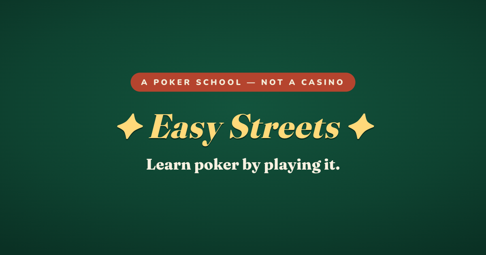

# ♠ Easy Streets

**Learn poker by playing it.** A poker *school*, not a casino.

Most poker apps throw you into the deep end. Easy Streets starts you with **one
card — higher wins** — and climbs one tiny new rule at a time, across 18
bite-size levels, all the way up to full No-Limit Texas Hold'em. By the end you
know the whole game and barely noticed you learned it.

▶ **Play:** https://poker.dorkalev.com &nbsp;·&nbsp; **Jump straight to full poker:** https://poker.dorkalev.com/play



---

## What it is

- **18 levels, 5 acts** — each level is a real, playable poker variant that adds
  one or two new rules on top of the last. No walls of text; the game teaches by
  letting you play.
- **6 rival characters**, each an archetype whose play style *is* the lesson —
  the calling station you must value-bet, the rock you can bluff, the maniac you
  call down, the chaser you charge, the positional thief, and a balanced final
  boss.
- **Trilingual** — English, Hebrew, and Arabic, with full right-to-left support.
- **Free, no sign-up, works offline** — progress is saved in your browser.

## The curriculum

| Act | Levels | You learn |
|-----|--------|-----------|
| **Card School** | 1–3 | Card ranks · ties split · your first pair |
| **Chips on the Line** | 4–6 | Ante & folding · check/bet/call · raising |
| **The Board** | 7–10 | Community cards · straights & flushes · the full hand ladder · betting streets |
| **Take Your Seat** | 11–13 | Blinds & the button · tight play · position · pot odds |
| **The Real Game** | 14–18 | No-limit & bluffing · all-in & side pots · kickers · the 6-max Main Event |

The finale (Level 18, "The Main Event") is genuine full No-Limit Texas Hold'em —
six-handed, four betting streets, the complete hand-rank ladder, no-limit
sizing, escalating blinds, no training wheels. `/play` drops you straight into
it.

## How it's built

The design goal was a **single poker engine driven entirely by per-level config**
— not 18 hard-coded games.

- **Pure, event-sourced engine** (`src/engine`) — a synchronous reducer,
  `step(state, action) → { state, events }`, with **no** React, DOM, timers, or
  randomness leakage. Every rule is a flag: `holeCards`, `communityCards`,
  `enabledHands` (early levels literally have fewer hand ranks), `betting` mode
  (none / stay-or-fold / fixed-limit / no-limit), blinds, side pots, and more.
  The UI animates the emitted event stream; the coach reacts to it; tests assert
  on it.
- **Custom hand evaluator** — supports *partial* rank sets, so with straights
  disabled `9-8-7-6-5` correctly demotes to nine-high. Property-tested against an
  independent brute-force reference.
- **Configurable rigged decks** — seeded, deterministic shuffles with optional
  bias, so a level can guarantee you flop a flush exactly when it's teaching
  flushes.
- **Rule-based bot opponents** (`src/bots`) — hand-strength via the Chen formula
  (preflop) and a small Monte-Carlo equity estimate (postflop), with per-persona
  tightness / aggression / bluff parameters and difficulty-scaled noise. No ML;
  fully deterministic and seedable.
- **Event-driven coach** (`src/coach`) — Penny narrates teachable moments by
  subscribing to the same event stream, gating the game when a concept needs a
  beat.
- **Thin React layer** (`src/ui`, `src/app`) — Zustand mirror + a single
  orchestrator that owns all timing; Motion for the juice (dealing, chip
  flights, celebrations); procedural WebAudio for sound (no audio assets).

```
src/
├─ engine/   # pure, tested game engine (evaluator, pots, betting, RNG)
├─ bots/     # rule-based opponents + personas
├─ coach/    # event-driven teaching layer
├─ levels/   # the 18 levels as data
├─ i18n/     # en · he · ar dictionaries
├─ app/      # zustand stores, orchestrator, sound, analytics
└─ ui/       # table, cards, chips, splash, overlays
```

## Run it locally

```bash
npm install
npm run dev        # http://localhost:5173
npm test           # vitest — engine, evaluator, pots, fairness
npm run build      # type-check + production bundle → dist/
```

Requires Node 18+. Tech: Vite · React 19 · TypeScript (strict) · Zustand · Motion.

## Testing

The engine is the correctness core and is heavily unit-tested with Vitest:

- Hand evaluator vs an independent brute-force reference (property tests via
  fast-check), including partial-rank demotion edge cases.
- Side-pot ladders, odd-chip splits, and a **chip-conservation invariant** across
  full headless hands.
- **Fairness audits** (`AUDIT=1 npm test`) — 20k-deal checks that no seat is
  favored, plus Monte-Carlo winnability simulations that tune each gate level's
  difficulty.

## Deploy

Static SPA, hosted on Firebase Hosting:

```bash
npm run build
firebase deploy --only hosting
```

## License

[MIT](LICENSE) © Dor Kalev.

Built with [React](https://react.dev), [Zustand](https://github.com/pmndrs/zustand),
and [Motion](https://motion.dev) (all MIT). Typefaces — Fraunces, Nunito, Frank
Ruhl Libre, Assistant, Amiri, Cairo — via Google Fonts under the SIL Open Font
License. The poker engine, hand evaluator, bot logic, and sound are original
work.

Made by [Dor Kalev](https://dorkalev.com).
